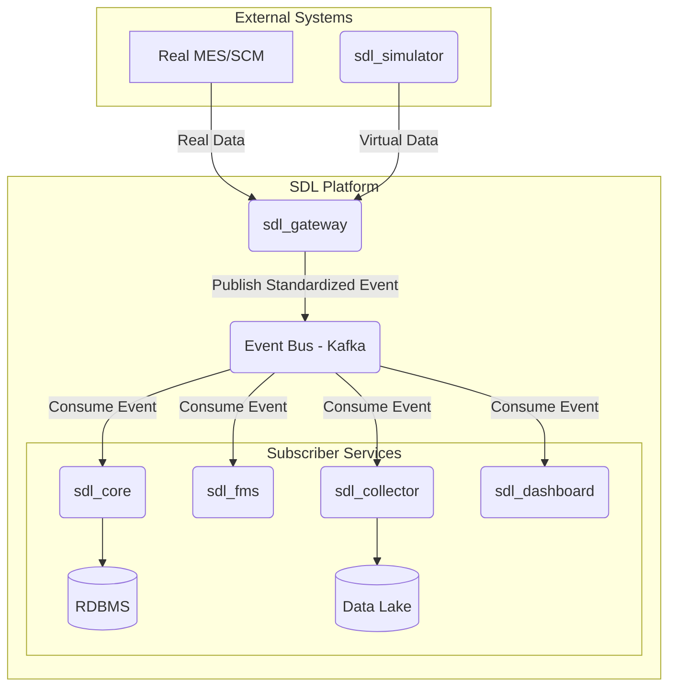
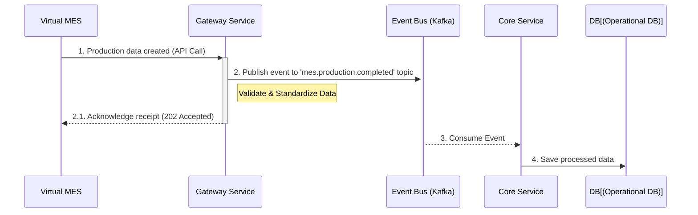

# SDL (Software-Defined Logistics)

A microservice-based data platform for flexibly connecting with external systems (e.g., MES, SCM) to process and analyze data in real-time, built on event-streaming technology with Apache Kafka.

## ✨ Key Features
Microservice Architecture: Each service (gateway, core, etc.) is designed to be developed, deployed, and scaled independently.

Event-Driven: Uses Apache Kafka as an event bus to ensure services are loosely coupled and can reliably handle high-volume data streams.

Built with TypeScript: All packages are written in TypeScript, ensuring type safety and high maintainability.

Centralized Common Modules: A monorepo structure allows for efficient management and reuse of shared logic, such as the @sdl/kafka-client.

## 🏗️ Architecture
This project adopts an event-driven microservice architecture to minimize coupling between services and facilitate horizontal scaling. All services communicate asynchronously through a central event bus (Kafka), allowing each to focus solely on its specific responsibilities.



## 🚀 Getting Started
Prerequisites
Node.js (v18 or higher)

npm (v9 or higher)

Docker & Docker Compose (to run Kafka)

### 1. Installation
   Clone the repository and run npm install from the project root. npm Workspaces will automatically install and link all dependencies for the sub-packages.

1. Clone the repository
```bash
git clone https://github.com/reidlo5135/SDL.git
```

2. Navigate to the project directory
```bash
cd sdl
```

3. Install all package dependencies
```bash
npm install
```

### 2. Running the Services
   With Kafka running in Docker, open two separate terminal sessions to run each service.

Terminal 1: Run the Core Service (Consumer)
```bash
npm run dev -w sdl-core
```

Terminal 2: Run the Gateway Service (Producer)
```bash
npm run dev -w sdl-gateway
```

You will now see the Core service receiving messages in real-time as they are sent by the Gateway.

## 📦 Project Structure
This project is a monorepo using npm Workspaces.
```bash
sdl/
├── package.json         # Manages the entire workspace
├── tsconfig.base.json   # Base TypeScript configuration
└── packages/
    ├── kafka-client/    # Shared Kafka client logic
    ├── gateway/         # Receives external data and publishes events (Producer)
    └── core/            # Subscribes to events and processes data (Consumer)
```
- packages/kafka-client: Provides a shared Kafka client instance and related utilities for use across all services.
- packages/gateway: The entry point for external data. It consumes data from outside systems, standardizes it, and publishes it as a Kafka event.
- packages/core: Subscribes to specific topics to process core business logic and persist data to a database.


## ⏱️ Data Flow
This diagram illustrates the journey of a single event as it flows through the platform.



## 📄 License
This project is licensed under the MIT License.